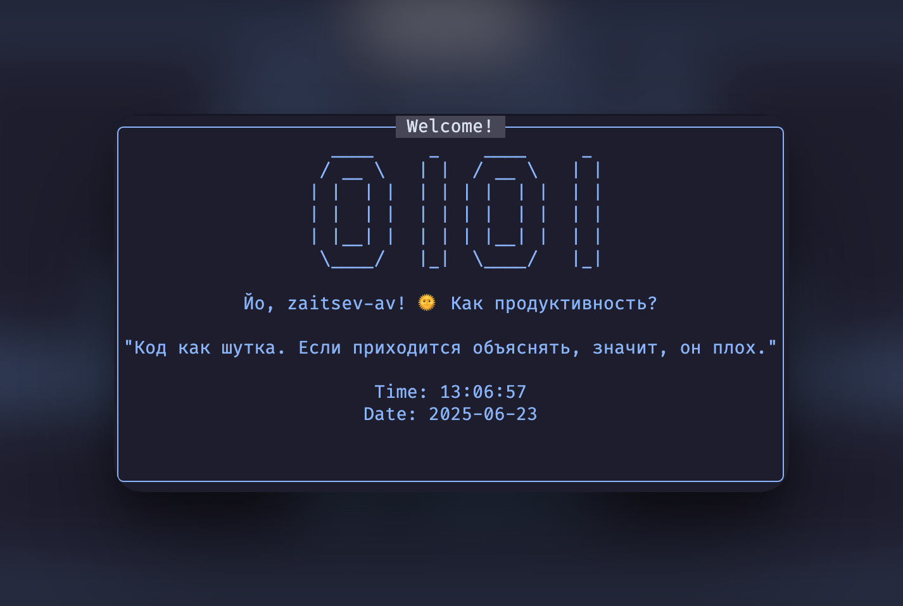

# Welcome-Time.nvim

A simple and highly customizable welcome screen for Neovim that displays ASCII art, a random quote, and a greeting that changes based on the time of day.



---

## English

### Features

-   **Dynamic Time Display**: Shows a clock that updates every second.
-   **Customizable Content**: Easily change ASCII art, quotes, and greetings.
-   **Time-Aware Greetings**: Greets you differently in the morning, afternoon, evening, and night.
-   **Flexible Closing Behavior**: Configure the screen to close automatically after a timer or when a file is opened.
-   **Easy to Configure**: A single configuration table to control everything.

### Installation

This plugin can be installed using your favorite plugin manager. Here is an example using `lazy.nvim`.

Add the following to your plugin configuration:

```lua
-- lua/plugins.lua
return {
  -- Other plugins
  
  {
    "zaitsev-av/welcome-time.nvim",
    lazy = false, -- Load on startup
    config = function()
      require("welcome-time").setup({
        -- Your custom configuration goes here
      })
    end,
  },
}
```
### Configuration

You can override any of the default settings by passing a table to the `setup` function.

**Default Configuration:**
```lua
require("welcome-time").setup({
  art = {""},
  quotes = {
    "The computer was created to solve problems that did not exist before.",
    "Simplicity is the soul of effectiveness.",
    -- ... and more
  },
  username = vim.fn.expand("$USER"),
  greetings = {
    morning = "Good morning, %s! ☀️",
    afternoon = "Good afternoon, %s! 🌞",
    evening = "Good evening, %s! 🌆",
    night = "Good night, %s! 🌙"
  },
  show_time = true,
  show_date = true,
  auto_close_time = 5000,
  close_on_file_open = true,
  highlight_group = "Title"
})
```

**Options:**
-   `art` (table): A list of strings, where each string is a line of ASCII art.
-   `quotes` (table): A list of strings. A random quote will be picked on startup.
-   `username` (string): The name used in the greeting.
-   `greetings` (table): A table containing greeting strings for `morning`, `afternoon`, `evening`, and `night`.
-   `show_time` (boolean): If `true`, displays the dynamic clock.
-   `show_date` (boolean): If `true`, displays the current date.
-   `auto_close_time` (number): Time in milliseconds to auto-close the window. **This is ignored if `close_on_file_open` is `true`**. Set to `0` to disable.
-   `close_on_file_open` (boolean): If `true` (default), the window closes as soon as a file is opened.
-   `highlight_group` (string): The highlight group for the text in the window.

**Example Customization:**
```lua
require("welcome-time").setup({
  username = "Code Wizard",
  close_on_file_open = false, -- Use timer instead
  auto_close_time = 10000,    -- Close after 10 seconds
  quotes = {
    "It works on my machine.",
    "99 little bugs in the code, 99 little bugs, take one down, patch it around, 127 little bugs in the code."
  },
  art = {
    "  /\\_/\\",
    " ( o.o )",
    "  > ^ <",
  }
})
```
---

## Русский

### Особенности

-   **Динамическое время**: Отображает часы, которые обновляются каждую секунду.
-   **Настраиваемый контент**: Легко изменяйте ASCII-арт, цитаты и приветствия.
-   **Приветствия по времени суток**: Приветствует вас по-разному утром, днем, вечером и ночью.
-   **Гибкое поведение закрытия**: Настройте закрытие экрана по таймеру или при открытии файла.
-   **Простая настройка**: Все параметры управляются через единую конфигурационную таблицу.

### Установка

Этот плагин можно установить с помощью вашего любимого менеджера плагинов. Вот пример для `lazy.nvim`.

Добавьте следующее в вашу конфигурацию плагинов:

```lua
-- lua/plugins.lua
return {
  -- Другие плагины
  
  {
    "zaitsev-av/welcome-time.nvim",
    lazy = false, -- Загружать при старте
    config = function()
      require("welcome-time").setup({
        -- Ваша кастомная конфигурация здесь
      })
    end,
  },
}
```
### Конфигурация

Вы можете переопределить любые стандартные настройки, передав таблицу в функцию `setup`.

**Конфигурация по умолчанию:**
```lua
require("welcome-time").setup({
  art = {""},
  quotes = {
    "Компьютер был создан для решения проблем, которых раньше не существовало.",
    "Простота — душа эффективности.",
    -- ... и другие
  },
  username = vim.fn.expand("$USER"),
  greetings = {
    morning = "Доброе утро, %s! ☀️",
    afternoon = "Добрый день, %s! 🌞",
    evening = "Добрый вечер, %s! 🌆",
    night = "Доброй ночи, %s! 🌙"
  },
  show_time = true,
  show_date = true,
  auto_close_time = 5000,
  close_on_file_open = true,
  highlight_group = "Title"
})
```

**Опции:**
-   `art` (table): Список строк, где каждая строка — это линия ASCII-арта.
-   `quotes` (table): Список строк. Случайная цитата будет выбрана при запуске.
-   `username` (string): Имя, используемое в приветствии.
-   `greetings` (table): Таблица со строками приветствий для `morning`, `afternoon`, `evening` и `night`.
-   `show_time` (boolean): Если `true`, отображает динамические часы.
-   `show_date` (boolean): Если `true`, отображает текущую дату.
-   `auto_close_time` (number): Время в миллисекундах для автозакрытия окна. **Игнорируется, если `close_on_file_open` равно `true`**. Установите `0`, чтобы отключить.
-   `close_on_file_open` (boolean): Если `true` (по умолчанию), окно закроется, как только будет открыт файл.
-   `highlight_group` (string): Группа подсветки для текста в окне.

**Пример кастомизации:**
```lua
require("welcome-time").setup({
  username = "Мастер Кода",
  close_on_file_open = false, -- Использовать таймер вместо закрытия по файлу
  auto_close_time = 10000,    -- Закрыть через 10 секунд
  quotes = {
    "Работает на моей машине.",
    "99 багов в коде висело, 99 багов в коде, один исправили, и вот — 127 багов в коде."
  },
  art = {
    "  /\\_/\\",
    " ( o.o )",
    "  > ^ <",
  }
})
```
